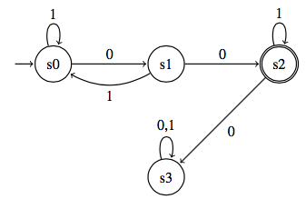
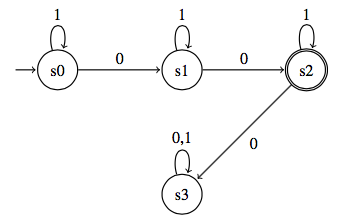

# HINTDSL Tutorial

*HINTDSL is standing in for a better name.*

Consider a simple homework problem for a theory of computation class. The student is asked to draw a deterministic finite automaton that will accept the language of strings over the alphabet `{0, 1}` such that there are exactly two `0`s. The student submits the DFA below:



But the correct solution is actually:



An autograder can mark the student's solution incorrect, but we'd like to provide more useful feedback about the nature of the mistake. Human graders can supply more detailed feedback, but the process is time-consuming and doesn't scale to large class sizes. Instead, we'd like to programmatically return some sort of hint about the incorrect solution, such as a counterexample (`010100`), a property that describes some set of incorrectly classified strings ("consider strings with no consecutive `0`s"), or perhaps a graphical annotation on the student's DFA. HINTDSL is designed to allow instructors to generate this kind of feedback. 

A HINTDSL hint is an expression of some difference between the student's incorrect solution and the correct solution given by the instructor (of course, if the student's solution is correct, there is no need for a hint). The HINTDSL is flexible and lets the instructor choose what kind of information to provide to the student. We assume that instructors already have some means of testing if a student solution is correct and are only searching for hints if the solution is known to be incorrect. A hint defined by HINTDSL requires as input only the true solution and the student's solution; it does not require any knowledge base or even an encoding of the problem itself.

There are three types of users who interact with HINTDSL. The first type is that of a student, who submits solutions and receives feedback defined in HINTDSL. The second type is that of an instructor, who writes the hints for each problem. HINTDSL is designed to allow instructors to put together hints fairly easily; ideally, a TA would be able to write hints with only minimal extra effort while authoring a problem set. This tutorial will primarily discuss HINTDSL from the point of view of this user type. The third user type is that of an admin who will create the machinery necessary to connect the homework submissions to the HINTDSL hints. This work should only be done once per course (or perhaps shared among those teaching similar courses). In the examples below, an admin would need to write macros to take the existing representation of the student's DFA (e.g., as JSON) and transform it into a Racket construct.  

Although this tutorial considers hints for problems writing DFAs, HINTDSL is sufficiently general to be used for a variety of domains.

## A simple counterexample hint
> Given the alphabet {0, 1}, write a DFA that accepts all strings that contain exactly 2 `0`s.

As a first example, let's write a hint that finds a string that is incorrectly accepted or incorrectly rejected on the student's solution. We assume that we already have a macro that will take the student's submitted automaton and return a Racket function that takes a word as an argument and returns true if that word is part of the language defined by that automaton. We won't discuss the details of the macro here, but see `automata.rkt` for a sample implementation.

Now, let's define our hint. Hints are always an expression of the difference between the student solution and the true solution. We will write a hint expressing the property "a word that the student DFA accepts and the correct DFA rejects, or vice versa". Essentially, we're asking if such a word exists, and if so, what it is. To do this, we'll use the `exists-word` function. This function takes the true solution and student solution DFAs, the alphabet the DFAs' language is made up of, and the maximum length of word we should consider, and a predicate that will return true if a given word has the property we're looking forward. This predicate should be written as a function that takes the student solution, true solutions and a word as an argument. Since we're looking for a counterexample, we can write the predicate as follows:

```
(define (diff-outcome? M1 M2 word)
  (not (eq? (M1 word) (M2 word))))
```

Since `M1` and `M2` are the result of the Racket macro that transforms an automaton representation into a function, if those two functions have different outcomes on the same input word, their corresponding automata behave differently on that word.

We can also test our predicate by supplying it with a word, without having to run the full hint to get an a result. Assume we have a student solution called `S1` and a true solution `T1`. We can check that `(diff-outcome? S1 T1 '(0 1 0 1 0))` returns `true` and that `(diff-outcome? S1 T1 '(0 0))` is false.

Now that our hint is defined, we can now automatically call this method when the student submits their solution and return the counterexample word, suitably formatted. Below is code that outputs the code using simple print statements.

```
(printf "Counterexample hint:\n")
(define ce (exists-word S1 T1 (list 0 1) 3 diff-outcome?))
(if (empty? ce)
    (printf "No counterexample of size ~a of less was found.\n\n" 3)
    (printf "The word ~a is a counterexample.\n\n" (word-value ce)))
```

If this hint was run on the examples above, it would return the counterexample word `010`.

## A more complicated hint

> Given the alphabet {0, 1}, write a DFA that accepts all words with the substring '01'.

Our first hint had to do with the semantic difference between the true and student solution: some word was either present in the language described by the true solution but not the student solution, or vice versa. We can also write hints that describe *syntactic* differences between the two true solutions.

States in a DFA represent equivalence classes; any string that arrives in a particular state, no matter what path it followed to get there, should have the same outcome. If two words arrive in the same state on the student DFA, but have different outcomes on the true DFA (i.e. one is accepted and one is rejected), then those words belong to different equivalence classes and therefore shouldn't be able to arrive in the same state. If we can identify two such words, then we know that the state they arrive in is defining an incorrect equivalence class, and we can return the name of that state to the student as a hint.

To find such a state, let's use a different search strategy; we'll use Rosette to synthesize an answer to the property we've formulated. Rosette is a solver-aided language that includes all of Racket; [see here for instructions for installing and using Rosette](https://github.com/emina/rosette).

First, we need to make a change to the macros we use to create our DFA representations. We'll use the same macro to create the true DFA, but we'll tweak the one used to build the student DFA so that after consuming a word, it returns the name of the state it arrives in. Given those behaviors, we need to synthesize two words that have the properties that they return the same value (a state name) on the student solution, but return different values (accept/reject) on the true solution.

In Rosette, these two words will be represented by two symbolic values defined by the method `word*`, a data type representing a sequence of symbols from the chosen alphabet, which can be between zero and k symbols in length. We then solve for values that hold true for our chosen properties.

```
(define (solve-split-state M1 M2 alphabet k)
  (define w (word* k alphabet))
  (define wprime (word* k alphabet))
  (m1 (evaluate w (solve (begin (assert (eq? (m1 w) (m1 wprime)))
                (assert (not (eq? (m2 w) (m2 wprime)))))))))
```

## A custom hint

> Given the alphabet { [0 0 0], [0 0 1], [0 1 0], ... , [1 1 0], [1 1 1]}, write a DFA to accept the language of words where the binary numbers formed by the first and second digits in each triple added together equal the number formed by the third digits. For example, `[0 0 1] [1 1 1] [1 1 0]` would be in this language, because 011 + 011 = 110. (This problem is taken from Sipser's textbook *The Theory of Computation*).

The previous two hints could be used for a wide variety of problems about writing DFAs. However, we can also define hints that are specific to a particular problem. In this problem, the symbols in our alphabet are used to express binary numbers. The challenge of the problem for students is to translate the process of handling binary numbers to defining a DFA; for example, they will need to consider how to account for a carry bit. Giving hints related to the syntactic structure of the DFA might be giving too much away. Instead, we will define a semantic hint that is expressed purely in the realm of binary arithmetic, rather than any properties of the DFA or even the alphabet itself.

If we represent the symbols of our alphabet as strings ("000", "001" and so on), we can write a method to take a list of such strings and return the three numbers they represent in binary. For example, given the word "000" "010" "111", we get back the list containing 3, 1, 3. Then, we can easily write a predicate that returns true if the first two numbers add up to the third and false otherwise. These methods, called `sigma3->decimal` and `add-pred`, can be found in `binaryhints.rkt`.

Since we can now compare the student's solution against this predicate and not the correct solution, we can write hints that check more fine-grained properties of the student's solution. For example, let's write a hint that checks that the student's solution correctly handles words consisting only of the symbols [0 0 0], [0 1 0], and [1 0 1]. These three symbols require no carries, so any word made up of only those symbols should always be accepted. We can do this by writing another Rosette query, one looking for a word from that alphabet that is rejected by the student solution and returns true when given to the predicate. (In fact, since all such words should be accepted, we don't even need to use the predicate, but it will be helpful when writing other such hints.)

```
(define (solve-no-carry M alphabet k)
  (define w (word* k alphabet))
  (evaluate w (solve (assert (diff-outcome? (M w) (add-predicate w))))))

(solve-no-carry M (list "000" "010" "101") 4)
```

If we can find such a word, we might give the student a hint such as "Consider addition when no carries are necessary". If we can't find one, we'll need to try synthesizing another hint. 

We can write similar predicates to check another properties of addition. We might try to find two words that are not commutative on the student's solution (e.g, if 1 + 2 = 3, 2 + 1 should also equal 3). We could try and synthesize a word in which an odd number plus an odd number is claimed to equal an odd number, or words that violate other such odd/even properties. Most simply, we could find a counterexample word and report it to the user in decimal format (3 + 4 does not equal 8).


