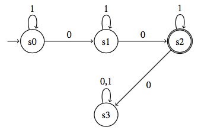

# HINTDSL Tutorial

*HINTDSL is standing in for a better name.*

Consider a simple homework problem for a theory of computation class. The student is asked to draw a deterministic finite automaton that will accept the language of strings over the alphabet `{0, 1}` such that there are exactly two `0`s. The student submits the DFA below:


But the correct solution is actually:


An autograder can mark the student's solution incorrect, but we'd like to provide more useful feedback about the nature of the mistake. Human graders can supply more detailed feedback, but the process is time-consuming and doesn't scale to large class sizes. Instead, we'd like to programmatically return some sort of hint about the incorrect solution, such as a counterexample (`010100`), a property that describes some set of incorrectly classified strings ("consider strings with no consecutive `0`s"), or perhaps a graphical annotation on the student's DFA. HINTDSL is designed to allow instructors to generate this kind of feedback. 

A HINTDSL hint is an expression of some difference between the student's incorrect solution and the correct solution given by the instructor (of course, if the student's solution is correct, there is no need for a hint). The HINTDSL is flexible and lets the instructor choose what kind of information to provide to the student. We assume that instructors already have some means of testing if a student solution is correct and are only searching for hints if the solution is known to be incorrect. A hint defined by HINTDSL requires as input only the true solution and the student's solution; it does not require any knowledge base or even an encoding of the problem itself.

There are three types of users who interact with HINTDSL. The first type is that of a student, who submits solutions and receives feedback defined in HINTDSL. The second type is that of an instructor, who writes the hints for each problem. HINTDSL is designed to allow instructors to put together hints fairly easily; ideally, a TA would be able to write hints with only minimal extra effort while authoring a problem set. This tutorial will primarily discuss HINTDSL from the point of view of this user type. The third user type is that of an admin who will create the machinery necessary to connect the homework submissions to the HINTDSL hints. This work should only be done once per course (or perhaps shared among those teaching similar courses). In the examples below, an admin would need to write macros to take the existing representation of the student's DFA (e.g., as JSON) and transform it into a Racket construct.  

Although this tutorial considers hints for problems writing DFAs, HINTDSL is sufficiently general to be used for a variety of domains.

## A simple counterexample hint
> Given the alphabet {0, 1}, write a DFA that accepts all strings that contain exactly 2 `0`s.

As a first example, let's write a hint that finds a string that is incorrectly accepted or incorrectly rejected on the student's solution. We assume that we already have a macro that will take the student's submitted automaton and return a Racket function that takes a word as an argument and returns true if that word is part of the language defined by that automaton. We won't discuss the details of the macro here, but see `automata.rkt` for a sample implementation.

Now, let's define our hint. Hints are always an expression of the difference between the student solution and the true solution. We will write a hint expressing the property "a word that the student DFA accepts and the correct DFA rejects, or vice versa". Essentially, we're asking if such a word exists, and if so, what it is. To do this, we'll use the `exists-word` construction. 

`exists-word` takes the true solution and student solution DFAs, the alphabet the DFAs' language is made up of, and the maximum length of word we should consider, and a predicate that will return true if a given word has the property we're looking forward. This predicate should be written as a function that takes the student solution, true solutions and a word as an argument. Since we're looking for a counterexample, we can write the predicate as follows:

```
(define (diff-outcome? M1 M2 word)
  (not (eq? (M1 word) (M2 word))))
```

Since `M1` and `M2` are the result of the Racket macro that transforms an automaton representation into a function, if those two functions have different outcomes on the same input word, their corresponding automata behave differently on that word.

We can also test our predicate by supplying it with a word, without having to run the full hint to get an a result. Assume we have a student solution called `S1` and a true solution `T1`. We can check that `(diff-outcome? S1 T1 '(0 1 0 1 0))` returns `true` and that `(diff-outcome? S1 T1 '(0 0))` is false.

Now that our hint is defined, we can now automatically call this method when the student submits their solution and return the counterexample word, suitably formatted. Below is code that outputs the hint using simple print statements.

```
(define ce (exists-word S1 T1 (list 0 1) 3 diff-outcome?))
(if (empty? ce)
    (printf "No counterexample of size ~a of less was found.\n\n" 3)
    (printf "The word ~a is a counterexample.\n\n" (word-value ce)))
```

If this hint was run on the examples above, it would return the counterexample word `010`.

## A more complicated hint

> Given the alphabet {0, 1}, write a DFA that accepts all words with the substring '01'.

Let's write a hint that expresses a slightly more abstract difference between the student and true solution. For this example we'll consider the correct solution


and the student solution



States in a DFA represent equivalence classes; any string that arrives in a particular state, no matter what path it followed to get there, should have the same outcome. If two words arrive in the same state on the student DFA, but have different outcomes on the true DFA (i.e. one is accepted and one is rejected), then those words belong to different equivalence classes and therefore shouldn't be able to arrive in the same state. If we can identify two such words, then we know that the state they arrive in is defining an incorrect equivalence class, and we can return the name of that state to the student as a hint.

First, we'll need to use a different macro to transform the representation of the student solution.  This macro will create a function that returns the name of the state the word arrived in after all symbols were consumed. (For example, given the word `010`, the student solution above would return `s2`.) We'll use the original macro to transform the true solution, so it returns true if the word it's given is part of the language the DFA defines.

This hint is trying to find two words that arrive in the same state on the student solution, but only one of them is accepted by the true solution. Unlike the example above, we need to find if two words with this property exist, and if so, what they are. For this we'll use the `exists-word-exists-word` construction. It behaves very similarly to the `exists-word` construct, but its predicate function takes two words rather than just one. We define the predicate function as below (keep in mind that `M1`, the student DFA, returns state names, but `M2`, the true DFA, returns a boolean).

```
(define (split-state-pred M1 M2 word wordprime)
  (and (eq? (M1 word) (M1 wordprime)) 
  (not (eq? (M2 word) (M2 wordprime)))))
```

We can test this function on the words `01` and `000`; these words both arrive in `s2` on the student solution, but they are also both accepted on the true solution, so the function will return false.

Given this predicate, as well as the other arguments, `exists-word-exists-word` will return a list containing two words that make the predicate true. If no such words exist, the function will return `null`. Below is a simple invocation of the hint. Note that once the two words are found, we take the first word and run the student DFA function on it to get the name of the state, using that in the text that's displayed to the student.

```
(define split-state-words (exists-word-exists-word S3 T3 (list 0 1) 10 split-state-pred))
(if (empty? split-state-words)
    (printf "\nNo split state was found when checking words up to ~a in length.\n\n" 10)
    (printf "\nWords that arrive in the state ~a have different behaviors on the true solution.\n\n" (S3 (word-value (car split-state-words)))))
```

## A custom hint

> Given the alphabet { [0 0 0], [0 0 1], [0 1 0], ... , [1 1 0], [1 1 1]}, write a DFA to accept the language of words where the binary numbers formed by the first and second digits in each triple added together equal the number formed by the third digits. For example, `[0 0 1] [1 1 1] [1 1 0]` would be in this language, because 011 + 011 = 110. (This problem is taken from Sipser's textbook *The Theory of Computation*).

The previous two hints could be used for a wide variety of problems about writing DFAs. However, we can also define hints that are specific to a particular problem. In this problem, the symbols in our alphabet are used to express binary numbers. The challenge of the problem for students is to translate the process of handling binary numbers to defining a DFA; for example, they will need to consider how to account for a carry bit. Giving hints related to the syntactic structure of the DFA might be giving too much away. Instead, we will define a semantic hint that is expressed purely in the realm of binary arithmetic, rather than any properties of the DFA or even the alphabet itself. For this example, we'll consider the true solution


and the student solution


For this hint, we will check to see if the student solution can handle adding two binary numbers with no carries correctly. We can do this by searching for a counterexample on the restricted alphabet {000, 010, 101}, since any sequence of these triples should never result in a carry. We can do this by simply reusing the counterexample hint we rewrote earlier, but using our restricted alphabet rather than the full alphabet.

```
(define ce (exists-word S3 T3 (list "000" "010" "101") 5 diff-outcome?))
(if (empty? ce)
    (printf "It looks like your DFA works correctly if your addition has no carries.\n\n" 3)
    (printf "Consider the counterexample ~a.\n\n" (word-value ce)))
```

## Underlying apparatus

The above hints are examples of things that might be written by an instructor preparing a problem set. In order to write hints for a domain, such as DFAs, some underlying structures need to be defined. We consider these "admin" level because these structures should only have to be defined once for each domain--anyone writing hints for DFAs can reuse them.

Previously we discussed the macros that need to be defined to take DFA representations as submitted by the student and transform into functions that can be used in defining hints. We discussed a macro that creates a function that returns true or false depending on whether a given word is accepted or rejected by the automaton, as well as a function that returns the state that a word arrives in. Other macros are possible: for example, one that outputs a trace of every state a word passes through as its symbols are consumed. 

Some machinery will also be needed to take the output of a hint and display it to the student. This will likely vary greatly depending on the users' needs. Above we simply printed the hints out, with a bit of explanatory text, but the hints might need to be passed to a web interface, transformed into a graphical representation, and so on.

Most importantly, we need implementations of the core functions in HINTDSL, such as `exists-word`, `exists-word-exists-word`, or `exists-word-forall-words`. These implementations are built around the concept of the student and true solutions defined as functions with a single input. These inputs are words, which can be built out of a given alphabet and restricted to a particular length or less. Finally, they use a predicate to determine if a given word matches the hint criteria. Given these structures, words can be found using any synthesis method or search strategy. Two implementations are checked in here: a brute force enumeration strategy, in `bruteforcemethods.rkt`, and a strategy using the Rosette solver-aided query language, in `rosettehintmethods.rkt`.
